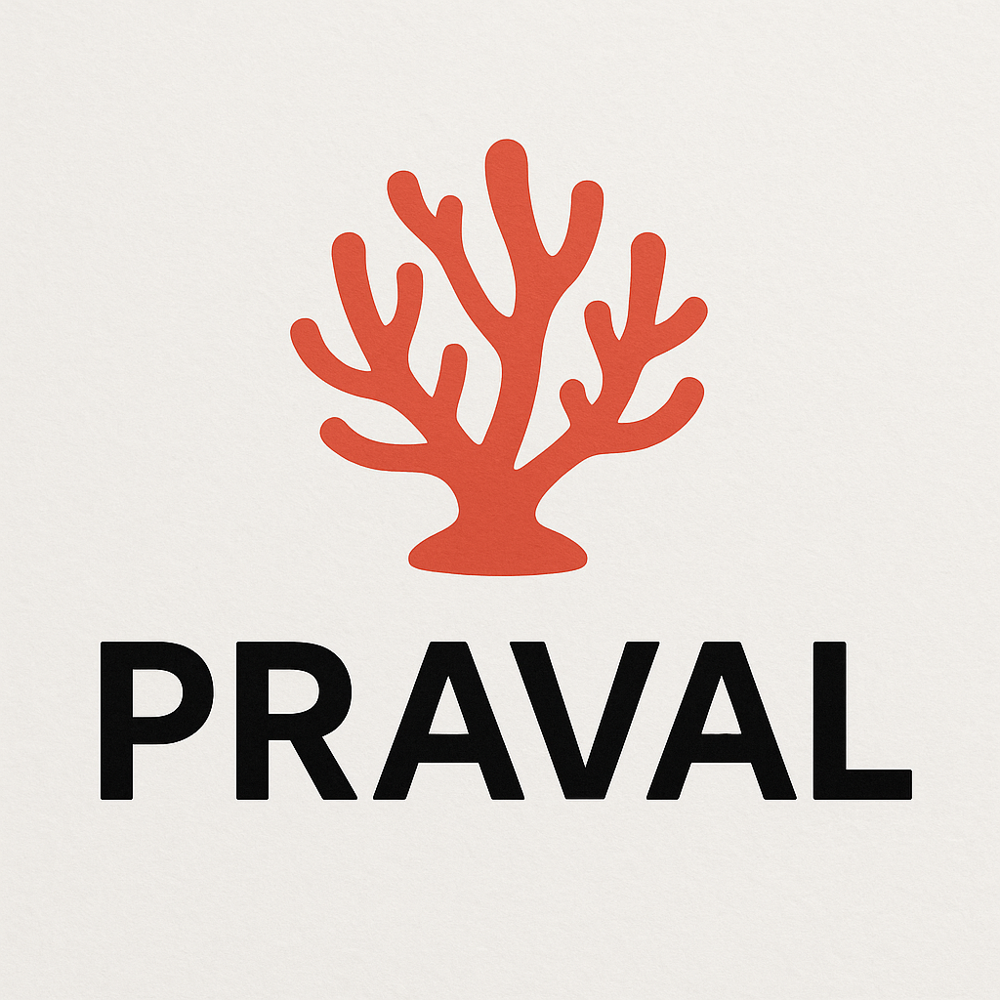

<div align="center">
  

  # Praval

  **A Python framework for agent systems and provider-neutral model execution**

  [](https://pypi.org/project/praval/)
  [](https://pypi.org/project/praval/)
  [](LICENSE)
</div>

Praval helps you build AI applications as cooperating agents. It keeps the
legacy decorator and `Agent.chat()` APIs, and adds a structured model runtime
for modern provider features: native streaming, structured outputs, multimodal
content parts, local OpenAI-compatible LLMs, tool/HITL orchestration, usage
tracking, and provider capability validation.

## Install

```bash
pip install praval

# Optional feature groups
pip install praval[memory]
pip install praval[storage]
pip install praval[mcp]  # Python 3.10+
pip install praval[all]
```

## Quick Start

```python
from praval import Agent

agent = Agent("assistant", provider="openai", model="gpt-5.4-mini")

response = agent.generate(
    "Return a short JSON summary of Praval.",
    response_schema={
        "type": "object",
        "properties": {"summary": {"type": "string"}},
        "required": ["summary"],
    },
)

print(response.content)
```

Legacy string-returning calls still work:

```python
print(agent.chat("Say hello in one sentence."))
```

## Local LLMs

Praval connects to already-running OpenAI-compatible HTTP servers:

```python
from praval import Agent

agent = Agent("local", provider="ollama", model="llama3")
print(agent.chat("Say hello."))
```

Presets are available for `ollama`, `vllm`, `lmstudio`, and `llama-cpp`.
Local profiles are conservative by default: text and streaming are enabled,
while tools, structured output, reasoning, and multimodal input require explicit
capability opt-in.

## Documentation

Sphinx is the canonical documentation surface:

- [Getting started](docs/sphinx/guide/getting-started.md)
- [Model runtime](docs/sphinx/guide/model-runtime.md)
- [Providers and capability matrix](docs/sphinx/guide/providers.md)
- [Local LLMs](docs/sphinx/guide/local-llms.md)
- [Streaming](docs/sphinx/guide/streaming.md)
- [Structured outputs](docs/sphinx/guide/structured-outputs.md)
- [Multimodal input](docs/sphinx/guide/multimodal.md)
- [MCP tool clients](docs/sphinx/guide/mcp.md)
- [Migration guide](docs/sphinx/guide/runtime-migration.md)
- [Emergent coordination architecture](docs/sphinx/architecture/emergent-coordination.md)

Provider model catalogs change quickly. Praval ships conservative registry
profiles for current known families, and production code should pass explicit
models that have been verified against provider documentation for the release.

Build docs locally:

```bash
make docs-html
```

## Development

```bash
make setup
source venv/bin/activate
make test
make lint
make type-check
make build
```

Offline runtime examples live in `examples/model_runtime_fake_provider.py`.
Live-provider examples are in `examples/structured_output_runtime.py`,
`examples/streaming_events.py`, and `examples/multimodal_input_runtime.py`.
