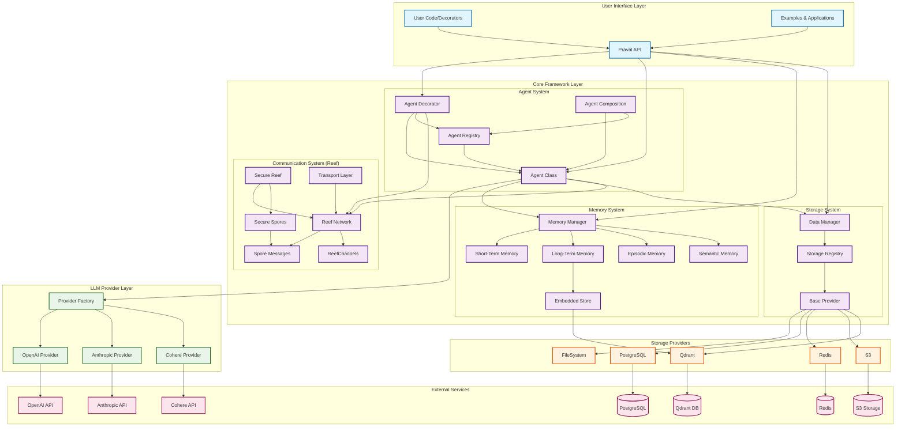

# Praval Framework Architecture

This document contains the comprehensive architecture diagram for the Praval framework, showing the relationships between all major components.

## Framework Architecture

## Component Descriptions

### User Interface Layer
- **User Code/Decorators**: Application code using Praval's decorator-based API
- **Praval API**: Main framework API exposed to users
- **Examples & Applications**: Sample applications demonstrating framework capabilities

### Core Framework Layer

#### Agent System
- **Agent Class**: Core agent implementation with LLM integration
- **Agent Decorator**: Pythonic `@agent` decorator for creating agents from functions
- **Agent Registry**: Discovery and management of agent instances
- **Agent Composition**: Orchestration and workflow management

#### Communication System (Reef)
- **Reef Network**: Message queue system inspired by coral reef communication
- **Spore Messages**: JSON-based knowledge-carrying messages
- **ReefChannels**: Named communication channels
- **Secure Reef**: Enterprise security layer for reef communication
- **Secure Spores**: Encrypted and authenticated spore messages
- **Transport Layer**: Pluggable transport mechanisms (AMQP, MQTT, STOMP)

#### Memory System
- **Memory Manager**: Unified interface coordinating all memory types
- **Short-Term Memory**: Fast working memory for immediate context
- **Long-Term Memory**: Persistent vector storage via Qdrant
- **Episodic Memory**: Conversation history and experience tracking
- **Semantic Memory**: Knowledge and fact storage
- **Embedded Store**: Vector embedding management

#### Storage System
- **Data Manager**: Unified interface for all storage operations
- **Storage Registry**: Registration and discovery of storage providers
- **Base Provider**: Abstract base class for storage implementations

### Provider Layers
- **Provider Factory**: Creates appropriate LLM provider instances
- **LLM Providers**: OpenAI, Anthropic, and Cohere integrations
- **Storage Providers**: Multiple backend implementations (PostgreSQL, Redis, S3, Qdrant, FileSystem)

### External Services
- External APIs and databases that providers connect to

## Key Design Patterns

1. **Coral Reef Metaphor**: Agents communicate through spores in reef channels, mimicking biological systems
2. **Decorator-Based API**: Simple agent decorator transforms functions into intelligent agents
3. **Multi-Provider Architecture**: Pluggable LLM and storage providers for flexibility
4. **Memory Hierarchy**: Multi-layered memory system from short-term to semantic storage
5. **Self-Organization**: Agents coordinate autonomously without central orchestration

## Data Flow

1. **User creates agents** using the agent decorator
2. **Agents communicate** through spores in reef channels
3. **Memory system** stores and retrieves context across interactions
4. **Storage system** persists data across multiple backends
5. **LLM providers** process requests and generate responses
6. **Results flow back** through the reef to requesting agents